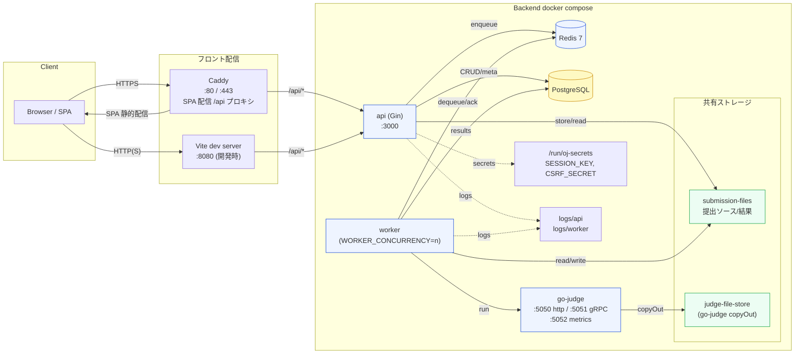
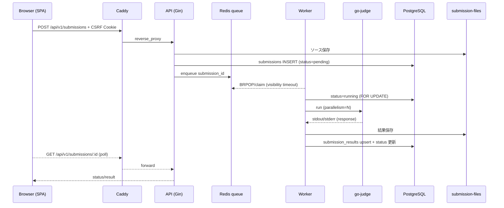

# アーキテクチャ構成図（2025-12-25 詳細版）

- worker は `WORKER_CONCURRENCY` でスケールアウト（go-judge の `-parallelism` と揃える）。
- Redis は `pending_submissions`（List）と `processing_submissions`（ZSET）に分離し、可視タイムアウトで再キューイング。
- 本番は Caddy が dist を配信し `/api/*` を api:3000 にプロキシ。開発時は Vite dev server から直接 API を叩く。

## 提出シーケンス（本番）

