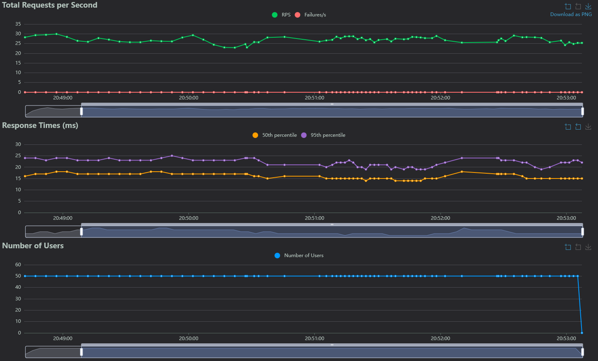
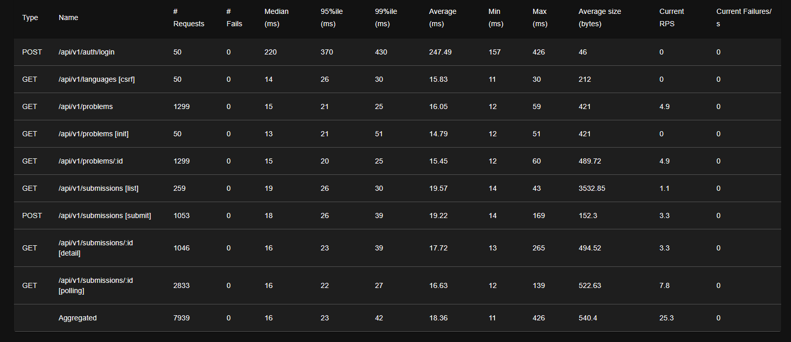

# ベンチマーク結果

## テスト環境

### インフラ構成
- **サーバー**: Xserver VPS
  - メモリ: 2GB
  - vCPU: 3コア
- **DNS**: Xserver DNS

### テスト条件
- **想定ユーザー数**: 50人
- **テスト時間**: 10分間
- **テスト日時**: 2025年12月

## 結果

### リクエスト/秒の推移

### システムメトリクス

## パフォーマンス測定結果

50人の同時ユーザーを想定した10分間の負荷テストを実施しました。

### 平均レスポンスタイム（AVG）

| エンドポイント | 平均レスポンスタイム |
|---------------|---------------------|
| 問題一覧取得 (GET /api/v1/problems) | 約16.1 ms |
| 問題詳細取得 (GET /api/v1/problems/:id) | 約15.5 ms |
| 提出作成 (POST /api/v1/submissions) | 約19.2 ms |
| 提出結果取得 (GET /api/v1/submissions/:id) | 約17.7 ms |
| ログイン (POST /api/v1/auth/login) | 約247.5 ms |

Xserver VPS（メモリ2GB、vCPU 3コア）の環境下で、10分間安定したレスポンスを維持できることを確認しました。

補足: RPS はおおむね 23–30 req/s で推移し、Failures/s は 0。P50 は 15–19 ms、P95 は 20–25 ms の範囲に収まりました。ログインのみパスワードハッシュ計算のため高めですが、他エンドポイントは 20 ms 前後で安定しています。

